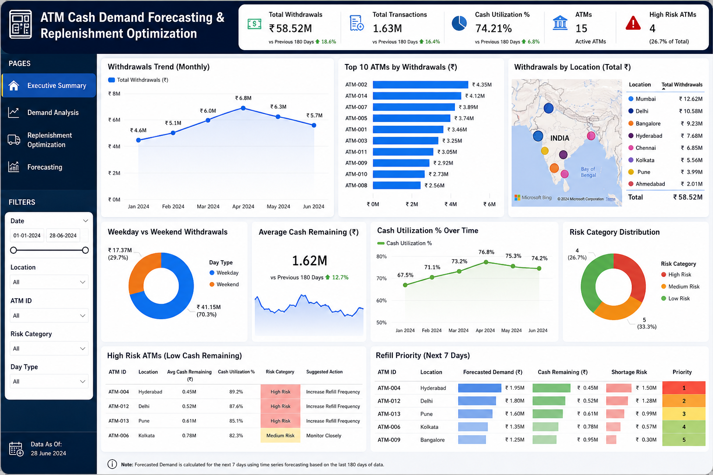

# ATMPulse: ATM Cash Demand Forecasting & Replenishment Optimization

## Dashboard Preview



**Tools Used:** SQL • Excel • Power BI

An end-to-end analytics project that forecasts ATM cash demand, identifies high-risk ATMs, and optimizes replenishment schedules to improve operational efficiency.

## Overview

ATMPulse is a Business Intelligence project developed to optimize ATM cash management operations. The project analyzes ATM withdrawal behavior, identifies high-risk ATMs, monitors cash utilization, and provides actionable recommendations to improve replenishment efficiency.

Using SQL, Excel, and Power BI, this project demonstrates how data-driven decision-making can reduce cash shortages, improve customer satisfaction, and lower operational costs.

## Business Problem

Banks operating large ATM networks often face the following challenges:

- ATM cash shortages
- Excess idle cash
- Frequent replenishment costs
- Uneven cash demand across locations
- Poor visibility into ATM performance

The goal of this project is to analyze ATM transaction patterns and develop an optimized replenishment strategy.

## Project Objectives

- Analyze ATM withdrawal trends
- Identify high-demand ATMs
- Detect high-risk cash shortage locations
- Monitor cash utilization performance
- Forecast future cash demand
- Support efficient replenishment planning

## Tools & Technologies

| Tool | Purpose |
|--------|----------|
| Excel | Data Cleaning & Preparation |
| SQL | Data Analysis |
| Power BI | Dashboard Development |
| DAX | KPI Calculations |
| GitHub | Project Documentation |

## Dataset Description

The dataset contains ATM transaction records across multiple locations.

### Features

| Column | Description |
|----------|-------------|
| ATM_ID | Unique ATM Identifier |
| Date | Transaction Date |
| Location | ATM Location |
| Transactions | Number of Transactions |
| Withdrawal_Amount | Total Withdrawal Amount |
| Cash_Loaded | Cash Loaded into ATM |
| Cash_Remaining | Remaining Cash Balance |
| Weekend_Flag | Weekend Indicator |

## Data Cleaning

Data preparation was performed using Excel.

### Cleaning Activities

- Removed duplicate records
- Checked missing values
- Standardized date formats
- Validated withdrawal amounts
- Created time-based attributes
- Verified location consistency

## SQL Analysis

Key SQL analyses performed:

### Top Cash Consuming ATMs

Identified ATMs with the highest withdrawal demand.

### Monthly Withdrawal Trends

Analyzed demand patterns over time.

### Weekend vs Weekday Analysis

Compared withdrawal behavior across different days.

### Cash Utilization Analysis

Measured ATM cash efficiency.

### High-Risk ATM Identification

Detected ATMs with consistently low cash balances.

## Key Performance Indicators (KPIs)

### Operational KPIs

- Total Withdrawals
- Total Transactions
- Average Daily Withdrawals
- Average Cash Remaining

### Risk KPIs

- High-Risk ATM Count
- Cash Utilization Rate
- Low Balance ATM Percentage

### Efficiency KPIs

- Replenishment Frequency
- Average Cash Availability
- Estimated Refill Cost Savings

## Power BI Dashboard

### Executive Summary

Provides a high-level overview of ATM operations.

**Visuals**
- KPI Cards
- Monthly Withdrawal Trend
- Location Performance
- Top ATM Analysis

### Demand Analysis

Analyzes customer withdrawal behavior.

**Visuals**
- Daily Withdrawal Trends
- Weekend vs Weekday Demand
- Location Comparison
- ATM Performance Ranking

### Replenishment Optimization

Supports cash replenishment decisions.

**Visuals**
- Cash Remaining by ATM
- ATM Risk Ranking
- Refill Priority Matrix
- Operational Savings Opportunities

### Forecasting

Predicts future ATM cash demand.

**Visuals**
- Actual vs Forecast Demand
- Next 7-Day Demand Projection
- High-Risk ATM Forecast

## Business Insights

### Insight 1

A small number of ATMs contribute to a significant percentage of total withdrawals.

### Insight 2

Weekend demand patterns differ from weekday behavior, affecting replenishment schedules.

### Insight 3

Certain locations consistently operate with lower cash balances, increasing shortage risk.

### Insight 4

Cash demand spikes during specific periods, indicating the need for dynamic cash allocation.

### Insight 5

Optimized replenishment schedules can reduce operational inefficiencies.

## Recommendations

### Short-Term Actions

- Increase cash loading for high-demand ATMs.
- Prioritize replenishment for low-balance locations.
- Monitor high-risk ATMs more frequently.

### Long-Term Actions

- Implement predictive replenishment models.
- Develop automated risk monitoring systems.
- Optimize replenishment routes.
- Adopt demand-based cash allocation strategies.

## Repository Structure

```text
ATMPulse-Cash-Demand-Forecasting-and-Replenishment-Optimization

│
├── Data
│   ├── ATM_Raw_Data.csv
│   └── ATM_Cleaned_Data.csv
│
├── SQL
│   └── analysis_queries.sql
│
├── PowerBI
│   └── ATM_Dashboard.pbix
│
├── README.md
│
└── github-post.png

## Future Enhancements

- Machine Learning-Based Forecasting
- ATM Failure Prediction
- Route Optimization for Replenishment Teams
- Real-Time Monitoring Dashboard
- Automated Alert System

## Author

Shambhavi Tripathi

Data Analyst | SQL | Excel | Power BI

### Connect With Me

- LinkedIn: Add Your LinkedIn Profile
- GitHub: Add Your GitHub Profile

## License

This project is intended for educational and portfolio purposes.

